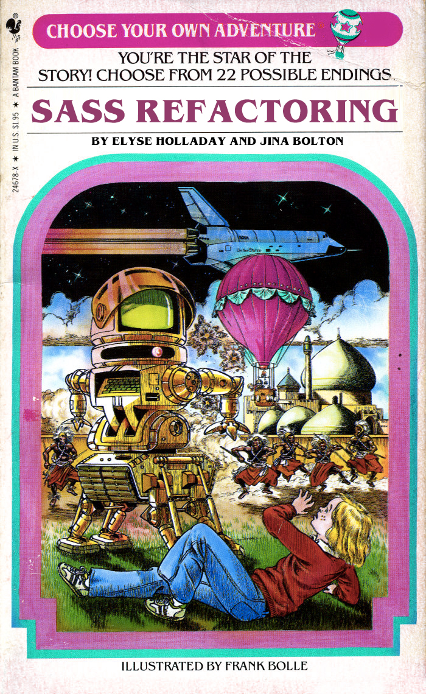

# Choose your own Refactoring Adventure!
#### A workshop at SassConf 2014 by Jina Bolton & Elyse Holladay

## Overview

Whether you’ve been using Sass for a while or are still trying to figure out how to abandon plain CSS, refactoring a large project can be a daunting task. We all know it’s too hard to refactor everything for months and launch it all at once, so how do you begin a multi-step refactoring process?

Jina Bolton is a San Francisco-based designer and developer best known for her work with Team Sass Design, speaking at conferences, and co-authoring two books: Fancy Form Design and The Art & Science of CSS. Currently she’s a Senior Product Designer with Salesforce UX on the Systems team; she works collaboratively across product teams to help identify and document interaction and visual design patterns. Elyse Holladay is a developer and instructor at MakerSquare, an Austin-based dev school. She has been involved in two large refactoring projects: taking three separate HTML & CSS codebases to a single, shared Sass codeset and a complete UI overhaul of a multi-app enterprise project. Their experience in maintaining large codebases has given them insight into the pitfalls—and joys—of refactoring.

In this four-hour workshop, Jina and Elyse will walk you through the basics of refactoring using Sass. You’ll receive guidelines for how to refactor for clarity, maintainability, efficiency, and DRY code, and learn how to test your changes. They’ll cover ways to break down a refactor into manageable chunks, help you understand how to modularize your CSS, and organize messy code into documented, style-guide ready files. Everyone will leave with a customized game plan of steps, tools, and guidelines to refactor their project—not a sample app—so bring your project code with you.

## Topics

Refactoring topics to be covered may include:

* overview of ways to use Sass (CodeKit, Rails, libsass, nodesass, etc.)
* creating color and typography variables
* breaking out and importing files
* determining CSS/UI modules, where they live in your app, and how to organize them
* namespacing for style safety
* commenting and in-CSS documentation
* creating living style guides
* naming conventions and refactoring classes/ID’s
* testing for changes

